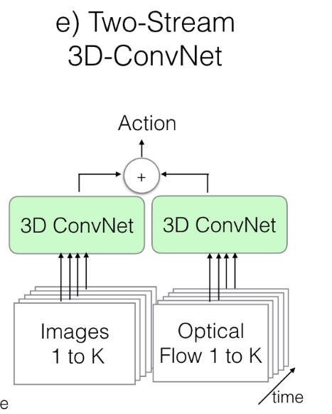
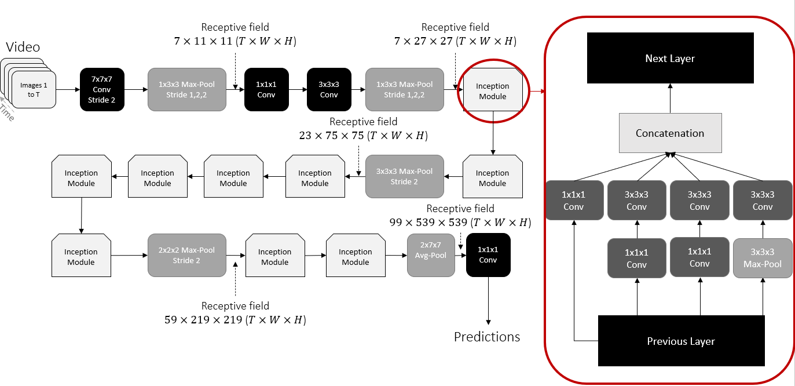

# similarity-assessment
相似性评估代码
### structure

### argparse
命令行交互\
parse.py 逻辑:
- get-args
  - benchmark --> 选dataset
  - exp_name --> 当前的任务命名
- set-up
  - 根据benchmark所选的dataset配置文件
  - .yaml 配置文件包括：1.预训练权重；2.dataset；3.优化的系数
  - .yaml 的key转成arg的属性
  - .yaml 转到对应的experiments下！